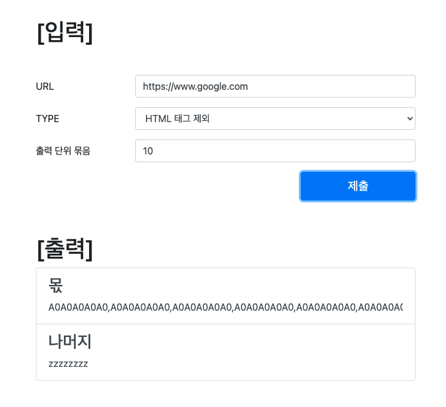

# 🚀 crawling-application

## 소개

- 입력된 주소를 크롤링하여 출력하는 어플리케이션입니다.
- URL을 입력하여 출력단위를 입력하여 제출하면, 크롤링한 결과를 영어,숫자를 교차하여 출력합니다.
- 옵션을 통하여 HTML을 제거할 것인지 제거하지 않을 것인지 선택할 수 있습니다.

## 실행방법

- 별도의 설치는 필요하지 않고 ```./gradlew bootrun```으로 실행가능합니다.
- 실행후 http://localhost:8080 으로 접속하여 테스트 가능합니다.
  

## 요구사항

- [X] 모든 문자 입력 가능합니다.
- [X] 영어 및 숫자만 출력합니다.
- [X] 오름차순 출력합니다.
- [X] 영어 숫자를 교차하여 출력합니다.


